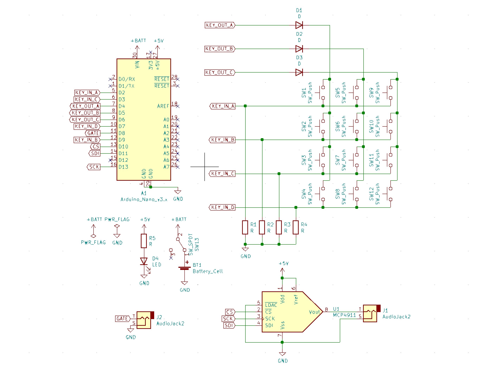
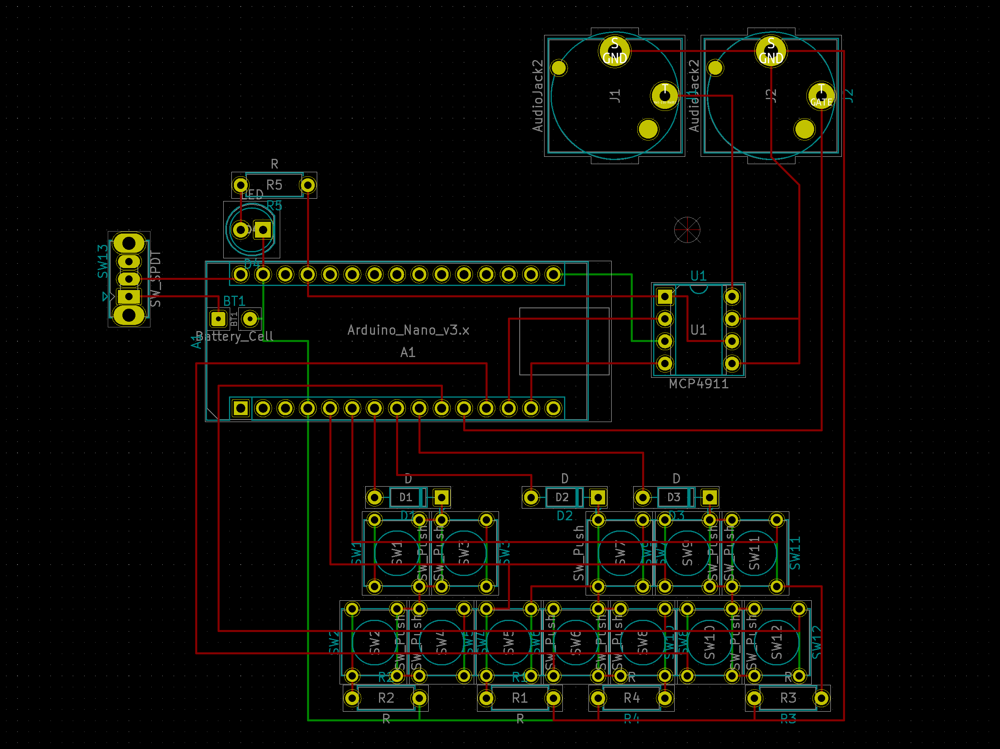
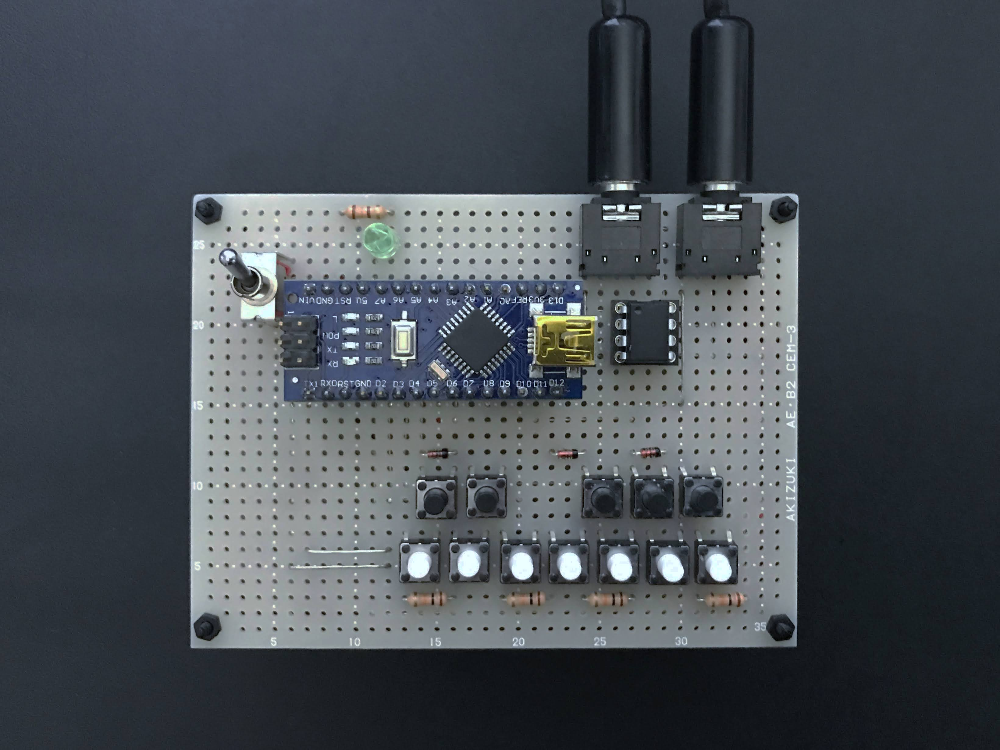

# minikeyboard

## 仕様

- 出力: CV/GATE 信号 (V/Hz)
- 音階: C4-B4 (多分)

## 回路図

## 配置

ユニバーサル基板用に配置

## 完成品

## 参照･参考

- https://info.shimamura.co.jp/digital/support/2020/02/136051
- https://www.arduino.cc/reference/en/libraries/mcp_dac/
- https://moutakusan.hatenablog.com/entry/2020/10/23/071000
